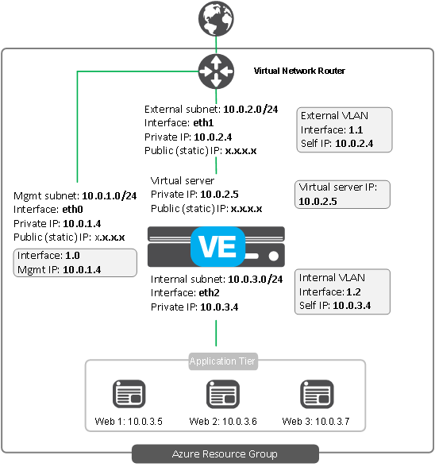

## Deploys F5 BIGIP Azure Cloud

This Terraform module deploys F5 BIGIP in Azure with the following characteristics:

- VM nics attached to a virtual network subnets of your choice (new or existing) via `var.vnet_subnet_id`.

## Exaple Usage

This contains the bare minimum options to be configured for the F5 BIGIP to be provisioned.  The entire code block provisions F5 BIGIP VM,

The F5 BIGIP will use the ssh key found in the default location `~/.ssh/id_rsa.pub`.

```hcl

provider azurerm {
  version = "~>2.0"
  features {}
}

#
# Create a random id
#
resource random_id id {
  byte_length = 2
}

#
# Create a resource group
#
resource azurerm_resource_group rg {
  name     = format("%s-rg-%s", var.prefix, random_id.id.hex)
  location = var.location
}

#
# Create the 1Nic BIGIP
#
module bigip {
  source                         = "./"
  dnsLabel                       = format("%s-%s", var.prefix, random_id.id.hex)
  resource_group_name            = azurerm_resource_group.rg.name
  vnet_subnet_id                 = module.network.vnet_subnets
  vnet_subnet_security_group_ids = [module.network-security-group.network_security_group_id]
  availabilityZones              = var.availabilityZones
  nb_nics                        = 1
  nb_public_ip                   = 1
}

#
# Create the Network Module to associate with BIGIP
#
module network {
  source              = "Azure/network/azurerm"
  version             = "3.1.1"
  resource_group_name = azurerm_resource_group.rg.name
  subnet_prefixes     = ["10.0.1.0/24"]
  subnet_names        = ["mgmt-subnet"]
}

module "network-security-group" {
  source                = "Azure/network-security-group/azurerm"
  resource_group_name   = azurerm_resource_group.rg.name
  security_group_name   = format("%s-nsg-%s", var.prefix, random_id.id.hex)
  source_address_prefix = ["10.0.1.0/24"]
  predefined_rules = [
    {
      name              = "LDAP"
      source_port_range = "1024-1026"
    }
  ]
  custom_rules = [
    {
      name                   = "myhttp"
      priority               = "200"
      direction              = "Inbound"
      access                 = "Allow"
      protocol               = "tcp"
      destination_port_range = var.nb_nics > 1 ? "443" : "8443"
      description            = "description-myhttp"
    },
    {
      name                   = "allow_ssh"
      priority               = "201"
      direction              = "Inbound"
      access                 = "Allow"
      protocol               = "tcp"
      destination_port_range = "22"
      description            = "Allow ssh connections"
    }
  ]
  tags = {
    environment = "dev"
    costcenter  = "terraform"
  }
}
```

## Template parameters

| Parameter 	| Type 	| Required 	| Default 	| Description 	|
|-	|-	|-	|-	|-	|
| dnsLabel/prefix 	| string 	| yes 	|  	| This value is inserted in the   beginning of each Azure object. Note: requires alpha-numeric without special   character 	|
| resource_group_name 	| string 	| yes 	|  	| The name of the resource group   in which the resources will be created 	|
| vnet_subnet_id 	| list 	| yes 	|  	| The subnet id of the virtual   network where the virtual machines will reside 	|
| vnet_subnet_security_group_ids 	| list 	| yes 	|  	| The Network Security Group id   of the virtual network 	|
| f5_username 	| string 	| yes 	| admin 	| The admin username of the F5   Bigip that will be deployed 	|
| f5_instance_type 	| string 	| yes 	| Standard_DS3_v2 	| Specifies the size of the   virtual machine 	|
| f5_image_name 	| string 	| yes 	|  	| F5 SKU (image) to you want to   deploy. Note: The disk size of the VM will be determined based on the option   you select. Important: If intending to provision multiple modules, ensure the   appropriate value is selected, such as AllTwoBootLocations or AllOneBootLocation. 	|
| f5_version 	| string 	| yes 	| latest 	| It is set to default to use the   latest software. 	|
| f5_product_name 	| string 	| yes 	| f5-big-ip-best 	| Azure BIG-IP VE Offer. 	|
| storage_account_type 	| string 	| yes 	| Standard_LRS 	| Defines the type of storage   account to be created. Valid options are Standard_LRS, Standard_ZRS,   Standard_GRS, Standard_RAGRS, Premium_LRS 	|
| allocation_method 	| string 	| yes 	| Dynamic 	| Defines how an IP address is   assigned. Options are Static or Dynamic 	|
| enable_accelerated_networking 	| bool 	| no 	| FALSE 	| (Optional) Enable accelerated   networking on Network interface 	|
| enable_ssh_key 	| bool 	| no 	| TRUE 	| (Optional) Enable ssh key   authentication in Linux virtual Machine 	|
| f5_ssh_publickey 	| string 	| no 	| ~/.ssh/id_rsa.pub 	| Path to the public key to be   used for ssh access to the VM. Only used with non-Windows vms and can be left   as-is even if using Windows vms. If specifying a path to a certification on a   Windows machine to provision a linux vm use the / in the path versus backslash.   e.g. c:/home/id_rsa.pub 	|
| ADMIN_PASSWD 	| string 	| yes 	| Default@1234 	| Password for the Virtual   Machine. 	|
| nb_nics 	| int 	| yes 	| 1 	| Specify the number of nic   interfaces 	|
| nb_public_ip 	| int 	| yes 	| 1 	| Number of public IPs to assign   corresponding to one IP per vm. Set to 0 to not assign any public IP   addresses 	|
| doPackageUrl 	| string 	| optional 	| latest 	| URL to download the BIG-IP   Declarative Onboarding module 	|
| as3PackageUrl 	| string 	| optional 	| latest 	| URL to download the BIG-IP   Application Service Extension 3 (AS3) module 	|
| tsPackageUrl 	| string 	| optional 	| latest 	| URL to download the BIG-IP   Telemetry Streaming module 	|
| fastPackageUrl 	| string 	| optional 	| latest 	| URL to download the BIG-IP FAST   module 	|
| cfePackageUrl 	| string 	| optional 	| latest 	| URL to download the BIG-IP   Cloud Failover Extension module 	|
| availabilityZones 	| list 	| yes 	| [] 	| If you want the VM placed in an   Azure Availability Zone, and the Azure region you are deploying to supports   it, specify the numbers of the existing Availability Zone you want to use 	|

# Configuration Examples

### Example Diagram for 1-nic:


### Example Diagram for 2-nic:


### Example Diagram for 3-nic:


